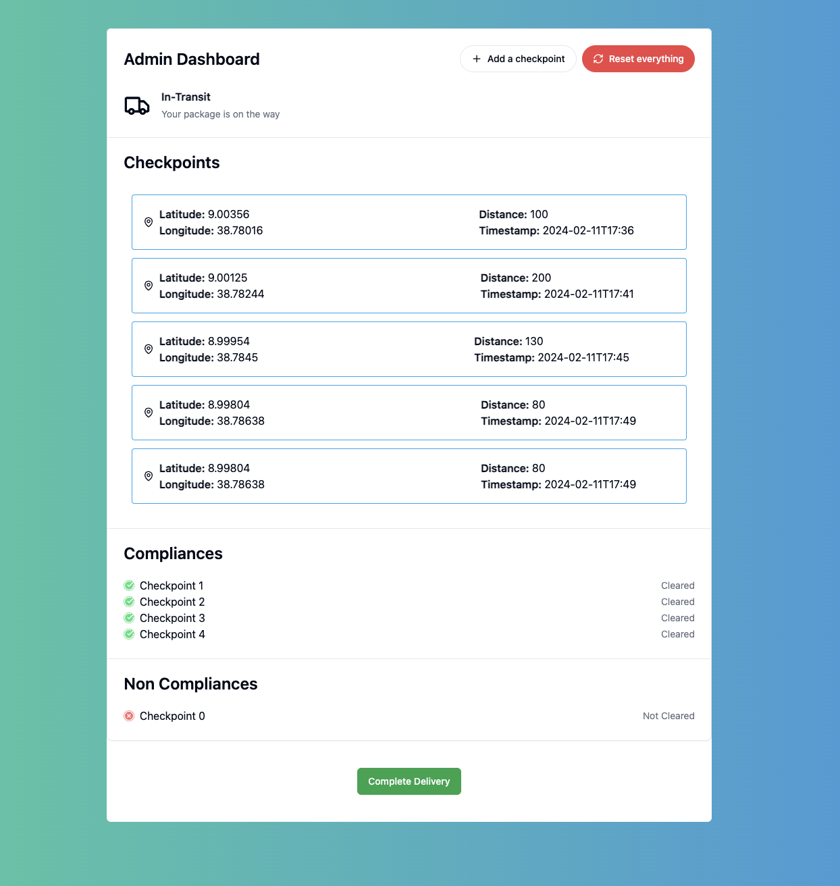
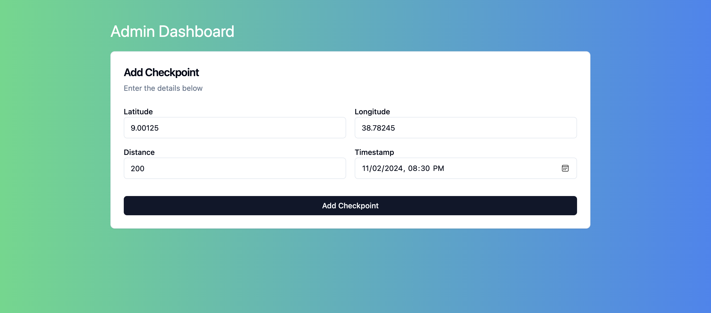
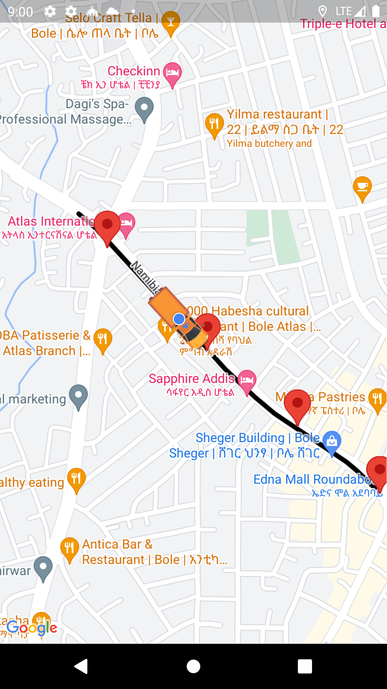

# web3-mobile-app-for-delivery-payments

## Overview

GeoLogix Solutions transforms the logistics and delivery sector through cutting-edge GPS and blockchain technology, ensuring punctual deliveries in specified zones via an Ethereum-based dApp. The company pioneers efficiency, reliability, and transparency, utilizing a location-based smart contract to automatically reward drivers for adhering to geographic compliance. The system involves drivers’ smartphones transmitting GPS data to an Ethereum smart contract, processing cryptocurrency transactions as payment upon meeting contract conditions. In the event of non-compliance, the smart contract updates, affecting the driver’s internal rating, which is part of a system that penalizes deviations and rewards adherence with an incentive (in this case, transferring ether).

## Preview

## Expected outcome

- Setup tool chains to build and deploy Ethereum based smart contracts
- Program in Solidity using Brownie or Hardhat
- Test and debug smart contracts

## Tools used

- Ethereum blockchain technology
- Hardhat compiler
- Sepolia testnet
- Alchemy blockchain node provider

## Installation / Setup and running steps

Include a _.env_ file with the following format if you want to deploy your own smart contract:

<pre>
ALCHEMY_TESTNET_RPC_URL = ""
PRIVATE_KEY = ""
</pre>

Deploy the contract by running the following commands on your terminal:

<pre>
> npm install
> npx hardhat compile
> npx hardhat run scripts/deploy.js --network sepolia </pre>

You can change the smart contract address for the web at the `Admin.jsx` and `AddCheckpoint.jsx` files and for the mobile app, at the `smart_contract_repository.dart` file. Make sure you've also copied the correct abi file and replaced it inside `src/assets` for the web app and `assets/contracts` for the mobile app.

For the web app, you can run the following command to start it:

<pre>
> npm install
> npm run dev
</pre>

For the mobile app, first create a .env file with the following format:

<pre>
ALCHEMY_TESTNET_RPC_URL = ""
PRIVATE_KEY = ""
ROUTE_API_KEY= ""
</pre>

Then start the app by running the following command:

<pre>
> flutter run
</pre>

## References

1. Medium article, https://medium.com/ethereum-developers/the-ultimate-end-to-end-tutorial-to-create-and-deploy-a-fully-descentralized-dapp-in-ethereum-18f0cf6d7e0e
2. CryptoZombies tutorial, https://cryptozombies.io/
3. Etherum Stack Exchange, https://ethereum.stackexchange.com/
4. Hardhat docs, https://hardhat.org/
5. Ethers.js docs, https://docs.ethers.io/v5/
